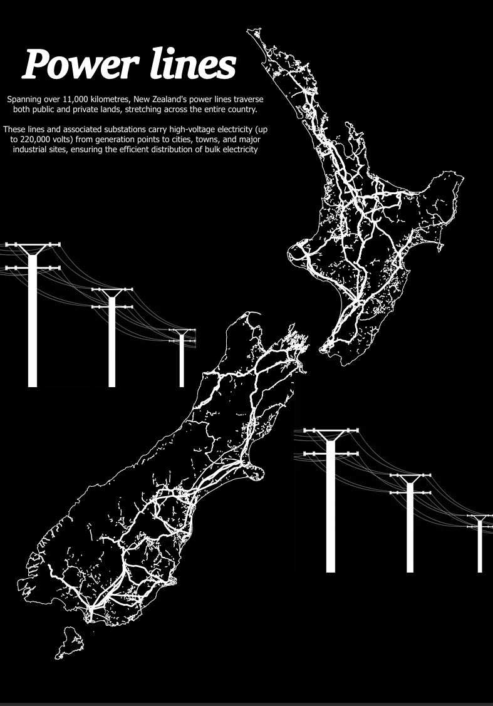

# ⚡ New Zealand Power Lines

A cartographic map of Aotearoa New Zealand's electricity transmission network, built in ArcGIS Pro from LINZ and Transpower open data.

        

<!-- TODO: adjust the image path to wherever the hero image lives in this repo -->

## Overview

This map traces the high-voltage lines that carry electricity the length of the country — from the hydro stations of the deep South, up through the HVDC link across Cook Strait, and out to the North Island's grid. The goal was a map that reads clearly at a glance: the network as infrastructure, set against the terrain it has to cross.

<!-- TODO: 2–3 sentences on what drew you to this map and what you wanted a viewer to notice. -->

## The map

  

<!-- TODO: optional — add detail crops (e.g. the Cook Strait HVDC link, or a dense urban grid) as extra images. -->

## Data

All layers are open data, projected to **NZGD2000 / New Zealand Transverse Mercator (EPSG:2193)**.

- **Transmission lines** — Transpower national grid data <!-- TODO: add dataset name + link -->
- **Basemap, coastline & terrain** — [LINZ Data Service](https://data.linz.govt.nz/) (CC BY 4.0) <!-- TODO: list the specific LINZ layers you used -->

## How it was made

- **Software:** ArcGIS Pro
- **Projection:** EPSG:2193 (NZTM)
- **Workflow:** <!-- TODO: brief notes — hillshade/terrain treatment, line symbology, labelling, layout choices -->

## Attribution & licence

Basemap and terrain layers © [Toitū Te Whenua LINZ](https://data.linz.govt.nz/), licensed CC BY 4.0.
Transmission network data © Transpower New Zealand. <!-- TODO: confirm Transpower's licence terms -->

<!-- TODO: choose a licence for this repo (the map render vs. any code) and state it here. -->

---

Made in Canterbury, Aotearoa 🇳🇿 · [github.com/mvanenter](https://github.com/mvanenter)
